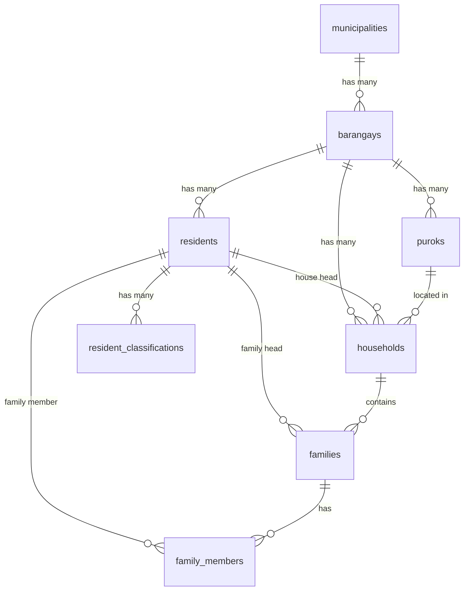

# Resident and Household Management Process Flow

## Overview

This document provides a comprehensive understanding of how residents and households are added to the BIMS (Barangay Information Management System) through a relational database architecture. The system uses PostgreSQL with PostGIS extension for geospatial data and implements a hierarchical structure for administrative divisions.

## Database Architecture

### Core Tables Structure

#### 1. Administrative Hierarchy
```
municipalities → barangays → puroks
```

#### 2. Resident Management
```
residents → resident_classifications
```

#### 3. Household Management
```
households → families → family_members
```

### Table Relationships



## Add Resident Process

### 1. Process Overview

The add resident process involves creating a new resident record with automatic ID generation, data validation, and optional classification assignment.

### 2. Step-by-Step Process

#### Step 1: Resident ID Generation
```javascript
async function generateResidentId() {
  const currentYear = new Date().getFullYear();
  const client = await pool.connect();
  
  try {
    await client.query("BEGIN");
    
    // Get prefix from resident_counters table
    const prefixResult = await client.query(GET_PREFIX);
    const prefix = prefixResult.rows[0]?.prefix?.trim() || "DFLT";
    
    // Insert/update counter for current year
    const result = await client.query(INSERT_PREFIX, [currentYear, prefix]);
    const nextId = String(result.rows[0].counter).padStart(7, "0");
    
    // Generate resident ID: PREFIX-YEAR-COUNTER
    const residentId = `${prefix}-${currentYear}-${nextId}`;
    
    await client.query("COMMIT");
    return residentId;
  } catch (error) {
    await client.query("ROLLBACK");
    throw error;
  }
}
```

**Database Operations:**
- **Table**: `resident_counters`
- **Operation**: `INSERT ... ON CONFLICT (year) DO UPDATE SET counter = counter + 1`
- **Result**: Unique resident ID in format `PREFIX-YEAR-COUNTER` (e.g., `DFLT-2024-0000001`)

#### Step 2: Resident Data Insertion
```javascript
const residentResult = await client.query(INSERT_RESIDENT, [
  residentId,           // Generated unique ID
  barangayId,           // Foreign key to barangays
  lastName,             // Required field
  firstName,            // Required field
  middleName,           // Optional field
  suffix,               // Optional field
  sex,                  // 'male' or 'female'
  civilStatus,          // 'single', 'married', 'widowed', 'separated', 'divorced'
  birthdate,            // Required DATE field
  birthplace,           // Optional TEXT field
  contactNumber,        // Optional VARCHAR(15)
  email,                // Optional VARCHAR(100)
  occupation,           // Optional TEXT
  monthlyIncome,        // Optional DECIMAL(10,2)
  employmentStatus,     // 'employed', 'unemployed', 'self-employed', 'student', 'retired'
  educationAttainment,  // Optional VARCHAR(30)
  residentStatus,       // Default 'active'
  picturePath,          // Optional file path
  indigenousPerson      // Boolean field
]);
```

**Database Operations:**
- **Table**: `residents`
- **Constraints**: 
  - `barangay_id` must exist in `barangays` table
  - `sex` must be 'male' or 'female'
  - `civil_status` must be valid enum value
  - `resident_status` defaults to 'active'

#### Step 3: Classification Assignment
```javascript
const classificationResults = [];
for (const classification of classifications) {
  const details = JSON.stringify(classification.details || "");
  
  const result = await client.query(INSERT_CLASSIFICATION, [
    residentId,                    // Foreign key to residents
    classification.type,           // Classification type (e.g., 'senior_citizen')
    details                        // JSONB field for additional details
  ]);
  classificationResults.push(result.rows[0]);
}
```

**Database Operations:**
- **Table**: `resident_classifications`
- **Fields**: 
  - `resident_id`: Links to residents table
  - `classification_type`: String identifier
  - `classification_details`: JSONB field for flexible data storage

### 3. Database Schema for Residents

```sql
CREATE TABLE residents (
    id VARCHAR(20) PRIMARY KEY,                    -- Generated unique ID
    barangay_id INTEGER NOT NULL,                  -- Foreign key to barangays
    last_name VARCHAR(50) NOT NULL,                -- Required
    first_name VARCHAR(50) NOT NULL,               -- Required
    middle_name VARCHAR(50),                       -- Optional
    suffix VARCHAR(10),                            -- Optional
    sex VARCHAR(10) NOT NULL CHECK (sex IN('male', 'female')),
    civil_status VARCHAR(25) NOT NULL CHECK (civil_status IN ('single', 'married', 'widowed', 'separated', 'divorced')),
    birthdate DATE NOT NULL,                       -- Required
    birthplace TEXT,                               -- Optional
    contact_number VARCHAR(15),                    -- Optional
    email VARCHAR(100),                            -- Optional
    occupation TEXT,                               -- Optional
    monthly_income DECIMAL(10,2),                  -- Optional
    employment_status VARCHAR(20) CHECK (employment_status IN ('employed', 'unemployed', 'self-employed', 'student', 'retired', 'not_applicable')),
    education_attainment VARCHAR(30),              -- Optional
    resident_status VARCHAR(15) DEFAULT 'active' CHECK (resident_status IN ('active', 'deceased', 'moved_out', 'temporarily_away')),
    picture_path TEXT,                             -- Optional file path
    indigenous_person BOOLEAN DEFAULT FALSE,       -- Boolean flag
    created_at TIMESTAMP DEFAULT CURRENT_TIMESTAMP,
    updated_at TIMESTAMP DEFAULT CURRENT_TIMESTAMP,
    FOREIGN KEY (barangay_id) REFERENCES barangays(id) ON DELETE CASCADE
);
```

## Add Household Process

### 1. Process Overview

The add household process creates a household record with location data, housing information, and optional family composition. This process is more complex as it involves multiple related tables.

### 2. Step-by-Step Process

#### Step 1: Household Creation
```javascript
// Prepare geometry data for PostGIS
let geomSQL = null;
if (geom && geom.lat && geom.lng) {
  const lat = parseFloat(geom.lat);
  const lng = parseFloat(geom.lng);
  geomSQL = `ST_GeomFromText('POINT(${lng} ${lat})', 4326)`;
}

// Insert household record
const { rows: householdRows } = await client.query(insertQuery, [
  houseNumber,           // Optional house number
  street,                // Optional street name
  purokId,              // Required foreign key to puroks
  barangayId,            // Required foreign key to barangays
  houseHead,             // Required foreign key to residents (must exist)
  housingType,           // Optional housing type
  structureType,         // Optional structure type
  electricity,           // Boolean for electricity availability
  waterSource,           // Optional water source type
  toiletFacility,        // Optional toilet facility type
  area,                  // Optional numeric area
  household_image_pathJSON // JSONB array of image paths
]);

const householdId = householdRows[0].id;
```

**Database Operations:**
- **Table**: `households`
- **Key Features**:
  - PostGIS geometry for location mapping
  - Foreign key constraints to `puroks`, `barangays`, and `residents`
  - JSONB field for multiple image paths

#### Step 2: Family Structure Creation
```javascript
if (families && Object.keys(families).length > 0) {
  let familyGroupCounter = 1;
  
  for (const familyKey of Object.keys(families)) {
    const family = families[familyKey];
    
    // Create family record
    const { rows: familyRows } = await client.query(INSERT_FAMILY, [
      householdId,                    // Foreign key to households
      `Group ${familyGroupCounter}`,  // Family group identifier
      family.familyHeadId             // Foreign key to residents
    ]);
    
    const familyId = familyRows[0].id;
    
    // Add family members
    for (const memberKey of Object.keys(family.familyMembers)) {
      const member = family.familyMembers[memberKey];
      
      await client.query(INSERT_FAMILY_MEMBER, [
        familyId,                     // Foreign key to families
        member.memberId,              // Foreign key to residents
        member.relationshipToHead     // Relationship description
      ]);
    }
    
    familyGroupCounter++;
  }
}
```

**Database Operations:**
- **Table**: `families`
  - Links to `households` via `household_id`
  - Links to `residents` via `family_head`
- **Table**: `family_members`
  - Links to `families` via `family_id`
  - Links to `residents` via `family_member`
  - Stores relationship information

### 3. Database Schema for Households

```sql
CREATE TABLE households (
    id SERIAL PRIMARY KEY,                           -- Auto-incrementing ID
    house_number VARCHAR(10),                        -- Optional house number
    street VARCHAR(50),                              -- Optional street name
    purok_id INTEGER NOT NULL,                       -- Required foreign key to puroks
    barangay_id INTEGER NOT NULL,                    -- Required foreign key to barangays
    house_head VARCHAR(20) NOT NULL,                 -- Required foreign key to residents
    housing_type VARCHAR(30),                        -- Optional housing type
    structure_type VARCHAR(30),                      -- Optional structure type
    electricity BOOLEAN DEFAULT FALSE,               -- Boolean for electricity
    water_source VARCHAR(30),                        -- Optional water source
    toilet_facility VARCHAR(30),                     -- Optional toilet facility
    geom GEOMETRY(GEOMETRY, 4326),                  -- PostGIS geometry for location
    area NUMERIC(10,2),                              -- Optional area measurement
    household_image_path TEXT,                       -- JSONB array of image paths
    created_at TIMESTAMP DEFAULT CURRENT_TIMESTAMP,
    updated_at TIMESTAMP DEFAULT CURRENT_TIMESTAMP,
    FOREIGN KEY (purok_id) REFERENCES puroks(id) ON DELETE CASCADE,
    FOREIGN KEY (barangay_id) REFERENCES barangays(id) ON DELETE CASCADE,
    FOREIGN KEY (house_head) REFERENCES residents(id) ON DELETE CASCADE
);

CREATE TABLE families (
    id SERIAL PRIMARY KEY,                           -- Auto-incrementing ID
    household_id INTEGER NOT NULL,                   -- Foreign key to households
    family_group VARCHAR(20) NOT NULL,               -- Family group identifier
    family_head VARCHAR(20) NOT NULL,                -- Foreign key to residents
    created_at TIMESTAMP DEFAULT CURRENT_TIMESTAMP,
    updated_at TIMESTAMP DEFAULT CURRENT_TIMESTAMP,
    FOREIGN KEY (family_head) REFERENCES residents(id) ON DELETE CASCADE,
    FOREIGN KEY (household_id) REFERENCES households(id) ON DELETE CASCADE
);

CREATE TABLE family_members (
    id SERIAL PRIMARY KEY,                           -- Auto-incrementing ID
    family_id INTEGER NOT NULL,                      -- Foreign key to families
    family_member VARCHAR(20) NOT NULL,              -- Foreign key to residents
    relationship_to_head VARCHAR(50),                -- Relationship description
    created_at TIMESTAMP DEFAULT CURRENT_TIMESTAMP,
    updated_at TIMESTAMP DEFAULT CURRENT_TIMESTAMP,
    FOREIGN KEY (family_member) REFERENCES residents(id) ON DELETE CASCADE,
    FOREIGN KEY (family_id) REFERENCES families(id) ON DELETE CASCADE
);
```

## Transaction Management

### 1. Atomic Operations

Both processes use database transactions to ensure data consistency:

```javascript
try {
  await client.query("BEGIN");
  
  // ... all database operations ...
  
  await client.query("COMMIT");
  return result;
} catch (error) {
  await client.query("ROLLBACK");
  logger.error("Operation failed:", error);
  throw error;
} finally {
  client.release();
}
```

### 2. Rollback Scenarios

- **Resident Creation Failure**: If any step fails, the entire resident record is rolled back
- **Household Creation Failure**: If household or family creation fails, all related records are rolled back
- **Data Validation Failure**: Invalid data triggers rollback before database insertion

## Data Validation and Constraints

### 1. Database-Level Constraints

```sql
-- Resident constraints
CHECK (sex IN('male', 'female'))
CHECK (civil_status IN ('single', 'married', 'widowed', 'separated', 'divorced'))
CHECK (resident_status IN ('active', 'deceased', 'moved_out', 'temporarily_away'))
CHECK (employment_status IN ('employed', 'unemployed', 'self-employed', 'student', 'retired'))

-- Foreign key constraints
FOREIGN KEY (barangay_id) REFERENCES barangays(id) ON DELETE CASCADE
FOREIGN KEY (house_head) REFERENCES residents(id) ON DELETE CASCADE
```

### 2. Application-Level Validation

```javascript
// Sanitize numeric fields
const sanitizedMonthlyIncome = monthlyIncome === "" ? null : monthlyIncome;

// Sanitize boolean fields
const sanitizedIndigenousPerson = 
  indigenousPerson === "" ? false :
  indigenousPerson === "Yes" || indigenousPerson === "True" ? true : false;
```

## Performance Considerations

### 1. Indexing Strategy

```sql
-- Residents table indexes
CREATE INDEX idx_residents_barangay ON residents(barangay_id);
CREATE INDEX idx_residents_name ON residents(last_name, first_name);
CREATE INDEX idx_residents_status ON residents(resident_status);

-- Households table indexes
CREATE INDEX idx_households_barangay ON households(barangay_id);
CREATE INDEX idx_households_purok ON households(purok_id);
CREATE INDEX idx_households_head ON households(house_head);
CREATE INDEX idx_households_geom ON households USING GIST (geom);

-- Family indexes
CREATE INDEX idx_families_household ON families(household_id);
CREATE INDEX idx_family_members_family ON family_members(family_id);
```

### 2. Query Optimization

- **Resident List**: Uses LEFT JOINs with proper indexing for efficient filtering
- **Household List**: Implements subqueries for family counting and income aggregation
- **Geospatial Queries**: Leverages PostGIS GIST indexes for location-based searches

## Error Handling

### 1. Common Error Scenarios

```javascript
// Foreign key constraint violations
if (error.code === '23503') {
  throw new ApiError(400, 'Referenced record does not exist');
}

// Unique constraint violations
if (error.code === '23505') {
  throw new ApiError(400, 'Record already exists');
}

// Check constraint violations
if (error.code === '23514') {
  throw new ApiError(400, 'Invalid data value');
}
```

### 2. Logging and Monitoring

```javascript
logger.error("Failed to insert resident:", error);
logger.error("Failed to insert household:", error);
```

## Security Considerations

### 1. Input Sanitization

- All user inputs are validated and sanitized before database insertion
- SQL injection prevention through parameterized queries
- File path validation for uploaded images

### 2. Access Control

- Role-based access control (RBAC) implementation
- Municipality and barangay-level data isolation
- Audit logging for all data modifications

## Integration Points

### 1. File Management

- Resident pictures stored with secure file paths
- Household images stored as JSONB arrays
- Automatic cleanup of orphaned files on deletion

### 2. Geospatial Integration

- PostGIS extension for location data
- Coordinate system: WGS84 (EPSG:4326)
- Support for point geometries and area calculations

### 3. Classification System

- Dynamic classification types per municipality
- JSONB storage for flexible classification details
- Color coding and categorization support

## Monitoring and Maintenance

### 1. Data Integrity Checks

```sql
-- Check for orphaned records
SELECT COUNT(*) FROM residents r 
LEFT JOIN barangays b ON r.barangay_id = b.id 
WHERE b.id IS NULL;

-- Check for circular references
SELECT COUNT(*) FROM households h 
JOIN residents r ON h.house_head = r.id 
WHERE h.id = r.id;
```

### 2. Performance Monitoring

- Query execution time monitoring
- Index usage statistics
- Database connection pool monitoring

## Add Pet Process

### 1. Process Overview

The add pet process involves creating a new pet record with owner validation, data validation, and optional vaccination record creation. This process integrates with the existing resident and household management system.

### 2. Step-by-Step Process

#### Step 1: Owner Validation
```javascript
async function validatePetOwner(ownerId) {
  const client = await pool.connect();
  
  try {
    // Verify owner exists and is active
    const ownerResult = await client.query(
      "SELECT id, first_name, last_name, resident_status FROM residents WHERE id = $1",
      [ownerId]
    );
    
    if (!ownerResult.rows[0]) {
      throw new ApiError(404, 'Pet owner not found');
    }
    
    const owner = ownerResult.rows[0];
    if (owner.resident_status !== 'active') {
      throw new ApiError(400, 'Pet owner is not an active resident');
    }
    
    return owner;
  } finally {
    client.release();
  }
}
```

**Database Operations:**
- **Table**: `residents`
- **Validation**: Owner must exist and have `resident_status = 'active'`
- **Result**: Owner information for pet registration

#### Step 2: Pet Data Insertion
```javascript
const petResult = await client.query(INSERT_PET, [
  ownerId,           // Foreign key to residents (validated)
  petName,           // Required field
  species,           // Required field (e.g., 'Dog', 'Cat', 'Bird')
  breed,             // Required field (e.g., 'Golden Retriever', 'Persian')
  sex,               // 'male' or 'female'
  birthdate,         // Required DATE field
  color,             // Required field (e.g., 'Brown', 'Black and White')
  picturePath,       // Optional file path
  description        // Optional TEXT field
]);

const petId = petResult.rows[0].id;
```

**Database Operations:**
- **Table**: `pets`
- **Constraints**: 
  - `owner_id` must exist in `residents` table
  - `sex` must be 'male' or 'female'
  - All required fields must be provided

#### Step 3: Vaccination Record Creation (Optional)
```javascript
if (vaccinations && vaccinations.length > 0) {
  for (const vaccination of vaccinations) {
    await client.query(INSERT_VACCINE, [
      'pet',                    // target_type
      petId,                    // target_id (pet ID)
      vaccination.vaccineName,  // Required vaccine name
      vaccination.vaccineType,  // Optional vaccine type
      vaccination.description,  // Optional description
      vaccination.vaccinationDate // Required vaccination date
    ]);
  }
}
```

**Database Operations:**
- **Table**: `vaccines`
- **Fields**: 
  - `target_type`: 'pet' for pet vaccinations
  - `target_id`: Links to pets table
  - `vaccine_name`: Name of the vaccine
  - `vaccination_date`: Date of vaccination

### 3. Database Schema for Pets

```sql
CREATE TABLE pets (
    id SERIAL PRIMARY KEY,                           -- Auto-incrementing ID
    owner_id VARCHAR(20) NOT NULL,                   -- Foreign key to residents
    pet_name VARCHAR(50) NOT NULL,                   -- Required pet name
    species VARCHAR(50) NOT NULL,                    -- Required species (Dog, Cat, Bird, etc.)
    breed VARCHAR(50) NOT NULL,                      -- Required breed
    sex VARCHAR(10) NOT NULL CHECK (sex IN ('male', 'female')),
    birthdate DATE NOT NULL,                         -- Required birth date
    color VARCHAR(20) NOT NULL,                      -- Required color description
    picture_path TEXT,                               -- Optional pet photo
    description TEXT,                                -- Optional additional info
    created_at TIMESTAMP DEFAULT CURRENT_TIMESTAMP,
    updated_at TIMESTAMP DEFAULT CURRENT_TIMESTAMP,
    FOREIGN KEY (owner_id) REFERENCES residents(id) ON DELETE CASCADE
);

CREATE TABLE vaccines (
    id SERIAL PRIMARY KEY,                           -- Auto-incrementing ID
    target_type VARCHAR(10) NOT NULL CHECK (target_type IN ('pet', 'resident')),
    target_id VARCHAR(20) NOT NULL,                  -- Links to pets or residents
    vaccine_name VARCHAR(100) NOT NULL,              -- Required vaccine name
    vaccine_type VARCHAR(50),                        -- Optional vaccine type
    vaccine_description TEXT,                        -- Optional description
    vaccination_date DATE NOT NULL,                  -- Required vaccination date
    created_at TIMESTAMP DEFAULT CURRENT_TIMESTAMP,
    updated_at TIMESTAMP DEFAULT CURRENT_TIMESTAMP
);
```

### 4. Pet Management Features

#### Pet Registration Fields
- **Basic Information**: Name, species, breed, sex, birthdate, color
- **Owner Information**: Links to resident record
- **Visual Documentation**: Optional pet photo
- **Additional Details**: Description field for special notes
- **Vaccination Records**: Optional vaccination tracking

#### Pet Search and Filtering
```javascript
// Search pets by various criteria
const searchCriteria = {
  species: 'Dog',           // Filter by species
  search: 'Buddy',          // Search by pet name or owner name
  barangayId: 1,            // Filter by barangay
  purokId: 2,               // Filter by purok
  page: 1,                  // Pagination
  perPage: 10,              // Records per page
  sortBy: 'pet_name',       // Sort field
  sortOrder: 'asc'          // Sort direction
};
```

#### Pet Statistics
```javascript
// Get pet statistics by barangay
const petStats = {
  totalPets: 150,
  bySpecies: {
    'Dog': 89,
    'Cat': 45,
    'Bird': 12,
    'Other': 4
  },
  vaccinatedPets: 120,
  vaccinationRate: 80.0
};
```

### 5. Transaction Management for Pets

```javascript
try {
  await client.query("BEGIN");
  
  // Validate owner
  const owner = await validatePetOwner(ownerId);
  
  // Insert pet
  const petResult = await client.query(INSERT_PET, [...]);
  const petId = petResult.rows[0].id;
  
  // Insert vaccinations if provided
  if (vaccinations) {
    for (const vaccination of vaccinations) {
      await client.query(INSERT_VACCINE, [...]);
    }
  }
  
  await client.query("COMMIT");
  return { petId, owner };
} catch (error) {
  await client.query("ROLLBACK");
  logger.error("Pet registration failed:", error);
  throw error;
}
```

### 6. Pet Data Validation

```javascript
// Validate pet data before insertion
function validatePetData(petData) {
  const errors = [];
  
  // Required field validation
  if (!petData.petName?.trim()) errors.push('Pet name is required');
  if (!petData.species?.trim()) errors.push('Species is required');
  if (!petData.breed?.trim()) errors.push('Breed is required');
  if (!petData.sex || !['male', 'female'].includes(petData.sex)) {
    errors.push('Sex must be male or female');
  }
  if (!petData.birthdate) errors.push('Birthdate is required');
  if (!petData.color?.trim()) errors.push('Color is required');
  
  // Date validation
  if (petData.birthdate && new Date(petData.birthdate) > new Date()) {
    errors.push('Birthdate cannot be in the future');
  }
  
  // Owner validation
  if (!petData.ownerId?.trim()) errors.push('Owner ID is required');
  
  return errors;
}
```

## Mobile SQLite Compatibility Analysis

### 1. Database Schema Compatibility

#### PostgreSQL to SQLite Migration Considerations

**Compatible Features:**
- ✅ **Basic Data Types**: VARCHAR, TEXT, INTEGER, BOOLEAN, DATE, TIMESTAMP
- ✅ **Primary Keys**: SERIAL (auto-increment) → INTEGER PRIMARY KEY AUTOINCREMENT
- ✅ **Foreign Keys**: Supported with proper constraints
- ✅ **Indexes**: Basic indexes supported
- ✅ **Check Constraints**: Supported for data validation
- ✅ **Default Values**: Supported for columns

**Incompatible Features:**
- ❌ **PostGIS Geometry**: SQLite doesn't support PostGIS
- ❌ **JSONB**: SQLite uses JSON (text-based) instead
- ❌ **SERIAL**: Use INTEGER PRIMARY KEY AUTOINCREMENT
- ❌ **Advanced Triggers**: Limited trigger support
- ❌ **Complex Functions**: Limited built-in functions

### 2. Required Schema Modifications for SQLite

#### Residents Table (SQLite Compatible)
```sql
CREATE TABLE residents (
    id TEXT PRIMARY KEY,                           -- VARCHAR(20) → TEXT
    barangay_id INTEGER NOT NULL,                  -- Compatible
    last_name TEXT NOT NULL,                       -- VARCHAR(50) → TEXT
    first_name TEXT NOT NULL,                      -- VARCHAR(50) → TEXT
    middle_name TEXT,                              -- VARCHAR(50) → TEXT
    suffix TEXT,                                   -- VARCHAR(10) → TEXT
    sex TEXT NOT NULL CHECK (sex IN('male', 'female')),
    civil_status TEXT NOT NULL CHECK (civil_status IN ('single', 'married', 'widowed', 'separated', 'divorced')),
    birthdate TEXT NOT NULL,                       -- DATE → TEXT (ISO format)
    birthplace TEXT,                               -- Compatible
    contact_number TEXT,                           -- VARCHAR(15) → TEXT
    email TEXT,                                    -- VARCHAR(100) → TEXT
    occupation TEXT,                               -- Compatible
    monthly_income REAL,                           -- DECIMAL(10,2) → REAL
    employment_status TEXT CHECK (employment_status IN ('employed', 'unemployed', 'self-employed', 'student', 'retired', 'not_applicable')),
    education_attainment TEXT,                     -- VARCHAR(30) → TEXT
    resident_status TEXT DEFAULT 'active' CHECK (resident_status IN ('active', 'deceased', 'moved_out', 'temporarily_away')),
    picture_path TEXT,                             -- Compatible
    indigenous_person INTEGER DEFAULT 0,           -- BOOLEAN → INTEGER (0/1)
    created_at TEXT DEFAULT CURRENT_TIMESTAMP,     -- TIMESTAMP → TEXT
    updated_at TEXT DEFAULT CURRENT_TIMESTAMP,     -- TIMESTAMP → TEXT
    FOREIGN KEY (barangay_id) REFERENCES barangays(id)
);
```

#### Households Table (SQLite Compatible)
```sql
CREATE TABLE households (
    id INTEGER PRIMARY KEY AUTOINCREMENT,          -- SERIAL → INTEGER PRIMARY KEY AUTOINCREMENT
    house_number TEXT,                             -- VARCHAR(10) → TEXT
    street TEXT,                                   -- VARCHAR(50) → TEXT
    purok_id INTEGER NOT NULL,                     -- Compatible
    barangay_id INTEGER NOT NULL,                  -- Compatible
    house_head TEXT NOT NULL,                      -- VARCHAR(20) → TEXT
    housing_type TEXT,                             -- VARCHAR(30) → TEXT
    structure_type TEXT,                           -- VARCHAR(30) → TEXT
    electricity INTEGER DEFAULT 0,                 -- BOOLEAN → INTEGER (0/1)
    water_source TEXT,                             -- VARCHAR(30) → TEXT
    toilet_facility TEXT,                          -- VARCHAR(30) → TEXT
    latitude REAL,                                 -- PostGIS → Separate lat/lng columns
    longitude REAL,                                -- PostGIS → Separate lat/lng columns
    area REAL,                                     -- NUMERIC(10,2) → REAL
    household_image_path TEXT,                     -- JSONB → TEXT (JSON string)
    created_at TEXT DEFAULT CURRENT_TIMESTAMP,     -- TIMESTAMP → TEXT
    updated_at TEXT DEFAULT CURRENT_TIMESTAMP,     -- TIMESTAMP → TEXT
    FOREIGN KEY (purok_id) REFERENCES puroks(id),
    FOREIGN KEY (barangay_id) REFERENCES barangays(id),
    FOREIGN KEY (house_head) REFERENCES residents(id)
);
```

#### Pets Table (SQLite Compatible)
```sql
CREATE TABLE pets (
    id INTEGER PRIMARY KEY AUTOINCREMENT,          -- SERIAL → INTEGER PRIMARY KEY AUTOINCREMENT
    owner_id TEXT NOT NULL,                        -- VARCHAR(20) → TEXT
    pet_name TEXT NOT NULL,                        -- VARCHAR(50) → TEXT
    species TEXT NOT NULL,                         -- VARCHAR(50) → TEXT
    breed TEXT NOT NULL,                           -- VARCHAR(50) → TEXT
    sex TEXT NOT NULL CHECK (sex IN ('male', 'female')),
    birthdate TEXT NOT NULL,                       -- DATE → TEXT (ISO format)
    color TEXT NOT NULL,                           -- VARCHAR(20) → TEXT
    picture_path TEXT,                             -- Compatible
    description TEXT,                              -- Compatible
    created_at TEXT DEFAULT CURRENT_TIMESTAMP,     -- TIMESTAMP → TEXT
    updated_at TEXT DEFAULT CURRENT_TIMESTAMP,     -- TIMESTAMP → TEXT
    FOREIGN KEY (owner_id) REFERENCES residents(id)
);
```

### 3. Data Type Conversion Guide

| PostgreSQL | SQLite | Notes |
|------------|--------|-------|
| SERIAL | INTEGER PRIMARY KEY AUTOINCREMENT | Auto-incrementing primary key |
| VARCHAR(n) | TEXT | No length limit in SQLite |
| DECIMAL(10,2) | REAL | Floating point number |
| BOOLEAN | INTEGER | 0 = false, 1 = true |
| DATE | TEXT | Store as ISO format (YYYY-MM-DD) |
| TIMESTAMP | TEXT | Store as ISO format (YYYY-MM-DD HH:MM:SS) |
| JSONB | TEXT | Store as JSON string |
| GEOMETRY | REAL, REAL | Store as separate latitude/longitude columns |

### 4. Index Creation for SQLite

```sql
-- Residents indexes
CREATE INDEX idx_residents_barangay ON residents(barangay_id);
CREATE INDEX idx_residents_name ON residents(last_name, first_name);
CREATE INDEX idx_residents_status ON residents(resident_status);

-- Households indexes
CREATE INDEX idx_households_barangay ON households(barangay_id);
CREATE INDEX idx_households_purok ON households(purok_id);
CREATE INDEX idx_households_head ON households(house_head);
CREATE INDEX idx_households_location ON households(latitude, longitude);

-- Pets indexes
CREATE INDEX idx_pets_owner ON pets(owner_id);
CREATE INDEX idx_pets_species ON pets(species);
CREATE INDEX idx_pets_breed ON pets(breed);
```

### 5. Mobile Implementation Considerations

#### Data Synchronization
```javascript
// Mobile SQLite operations
class MobilePetService {
  async addPet(petData) {
    const db = await this.getDatabase();
    
    try {
      await db.transaction(async (tx) => {
        // Validate owner exists
        const owner = await tx.executeSql(
          'SELECT * FROM residents WHERE id = ? AND resident_status = ?',
          [petData.ownerId, 'active']
        );
        
        if (owner.rows.length === 0) {
          throw new Error('Owner not found or inactive');
        }
        
        // Insert pet
        await tx.executeSql(
          `INSERT INTO pets (owner_id, pet_name, species, breed, sex, birthdate, color, picture_path, description)
           VALUES (?, ?, ?, ?, ?, ?, ?, ?, ?)`,
          [
            petData.ownerId,
            petData.petName,
            petData.species,
            petData.breed,
            petData.sex,
            petData.birthdate,
            petData.color,
            petData.picturePath,
            petData.description
          ]
        );
      });
    } catch (error) {
      console.error('Failed to add pet:', error);
      throw error;
    }
  }
}
```

#### Offline Capability
- **Local Storage**: All pet data stored locally in SQLite
- **Sync Queue**: Track changes for synchronization when online
- **Conflict Resolution**: Handle data conflicts during sync
- **Image Storage**: Store pet images locally with sync capability

### 6. Performance Optimization for Mobile

#### Query Optimization
```sql
-- Efficient pet search with owner info
SELECT 
  p.id,
  p.pet_name,
  p.species,
  p.breed,
  r.first_name || ' ' || r.last_name as owner_name,
  r.contact_number
FROM pets p
JOIN residents r ON p.owner_id = r.id
WHERE p.species = ? AND r.barangay_id = ?
ORDER BY p.pet_name
LIMIT 20;
```

#### Data Pagination
```javascript
// Implement pagination for large datasets
const getPetsPaginated = async (page = 1, limit = 20) => {
  const offset = (page - 1) * limit;
  
  const result = await db.executeSql(
    'SELECT * FROM pets ORDER BY pet_name LIMIT ? OFFSET ?',
    [limit, offset]
  );
  
  return result.rows;
};
```

## Conclusion

The resident and household management system in BIMS implements a robust, scalable architecture that ensures data integrity, performance, and maintainability. The use of PostgreSQL with PostGIS, proper indexing, transaction management, and comprehensive error handling makes it suitable for production use in barangay information management.

The pet management system extends this architecture with:
- **Comprehensive Pet Registration**: Full pet information with owner linking
- **Vaccination Tracking**: Optional vaccination record management
- **Search and Filtering**: Advanced pet search capabilities
- **Mobile Compatibility**: SQLite-compatible schema for mobile deployment

Key strengths of the system include:
- **Data Integrity**: Foreign key constraints and check constraints
- **Performance**: Strategic indexing and query optimization
- **Scalability**: Efficient data structures and relationships
- **Maintainability**: Clear separation of concerns and comprehensive logging
- **Flexibility**: JSONB fields for dynamic data and classification systems
- **Mobile Ready**: SQLite-compatible schema for offline mobile use

